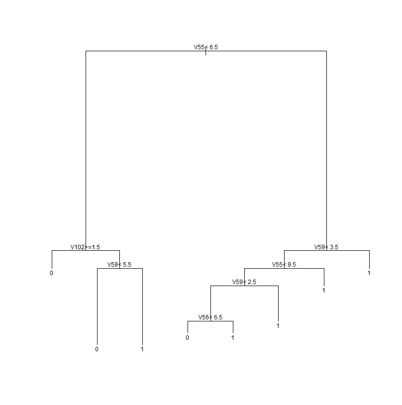
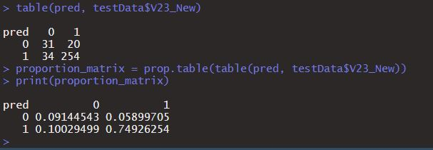

# Random Forests in R #

This is the very first homework from our Data Mining course where we started learning some machine learning methods. We used R to clean up the World Values dataset, split into training and testing, and create a random forest model.

### Tree Diagram ###
Here is what the random forest created for decisions to split:

### Confusion Matrix ### 
Here is the confusion matrix. The predicted values are on the left. 0 means they are not satisfied, and 1 means they are satisfied. The model ended up with about an 84% accuracy which is better than the naive accuracy of 80% (prediciting everyone to be satisfied). 

